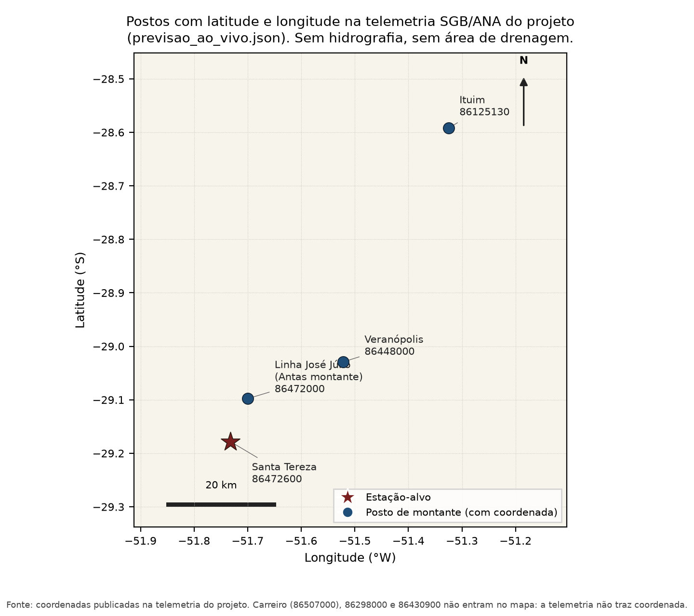

*Pesquisa FAPERGS 24/2551-0002124-8 · manuscrito para a Revista Brasileira de Recursos Hídricos*

# PREVISÃO DE NÍVEIS FLUVIAIS COM REDES NEURAIS ARTIFICIAIS: APLICAÇÃO À ESTAÇÃO SANTA TEREZA, BACIA DO RIO TAQUARI-ANTAS

Juliana Carolina Reis¹*; Guilherme Garcia de Oliveira¹; Fernanda Vier¹

¹ Afiliação institucional a confirmar.  
* Autor correspondente: julianacarolinoreis@gmail.com

## Resumo

O objetivo deste estudo foi avaliar o desempenho de redes neurais artificiais (RNAs) na previsão horária de nível na estação fluviométrica Santa Tereza (ANA/SGB 86472600), na bacia do rio Taquari-Antas, Rio Grande do Sul, Brasil, nos horizontes de 2, 4, 8 e 12 h. Os procedimentos adotados foram: i) organização do inventário de perceptrons de três camadas já treinados em MATLAB; ii) qualificação das redes com índice de persistência (PERS) positivo em treino, validação, teste e série completa, resultando em 282 modelos; iii) descrição das principais combinações de variáveis de entrada, sem métricas; iv) seleção de um único modelo por horizonte pelo índice de equilíbrio publicado no inventário; v) avaliação quantitativa por PERS, coeficiente de Nash-Sutcliffe (NS), erro absoluto médio (MAE) e percentil 95 do erro absoluto (E95). O modelo de 2 h, com 15 entradas de nível local e de montante e sem precipitação, apresentou índice de equilíbrio 0,969, NS de teste 0,996, MAE de 3,5 cm e E95 de 10,4 cm. Em 4 h, o modelo selecionado possui 24 entradas, incluindo a chuva média acumulada em 36 h (equilíbrio 0,846; NS 0,993; MAE 13,9 cm). Em 8 h, a RNA com 10 entradas (combinação C0289) atingiu equilíbrio 0,694, NS 0,940 e MAE 32 cm. Em 12 h, o modelo selecionado (C0149) atingiu equilíbrio 0,690, NS 0,885 e MAE 40,9 cm. Conclui-se que as RNAs reproduzem o nível na régua com ganho sobre a persistência nos quatro horizontes quando a seleção exige equilíbrio entre partições. O NS isolado de uma partição e o erro de uma janela do serviço experimental não substituem o teste por eventos de cheia.

**Palavras-chave: bacia hidrográfica do rio Taquari-Antas; redes neurais artificiais; previsão de nível fluvial; índice de persistência; Santa Tereza.**

## Abstract

The aim of this study was to evaluate artificial neural networks (ANNs) for hourly water-level forecasting at the Santa Tereza gauging station (ANA/SGB 86472600), Taquari-Antas River basin, Rio Grande do Sul, Brazil, at 2, 4, 8 and 12 h lead times. The procedures were: i) organisation of an inventory of three-layer perceptrons already trained in MATLAB; ii) retention of networks with positive persistence index (PERS) on training, validation, testing and the full series (282 models); iii) description of the main input combinations, without performance metrics; iv) selection of one model per horizon by the published equilibrium score; v) evaluation using PERS, the Nash-Sutcliffe coefficient (NS), mean absolute error (MAE) and the 95th percentile of absolute error (E95). The 2 h model, with 15 local and upstream stage inputs and no rainfall, attained an equilibrium score of 0.969, NS of 0.996, MAE of 3.5 cm and E95 of 10.4 cm. At 4 h the selected model has 24 inputs including 36 h mean accumulated rainfall (equilibrium 0.846; NS 0.993; MAE 13.9 cm). At 8 h the 10-input network (combination C0289) reached 0.694, NS 0.940 and MAE 32 cm. At 12 h the selected model reached 0.690, NS 0.885 and MAE 40.9 cm. ANNs reproduce stage with skill over persistence at all four horizons when selection requires balance across partitions. Partition-wise NS and the error of an experimental-service window do not replace event-based testing.

**Keywords: Taquari-Antas River basin; artificial neural networks; river-level forecasting; persistence index; Santa Tereza.**

## 1 INTRODUÇÃO

As redes neurais artificiais (RNAs) são modelos matemáticos empíricos, com capacidade de armazenar conhecimento experimental por meio do treinamento e da resposta aos estímulos (variáveis de entrada). A difusão da técnica em hidrologia está ligada ao algoritmo retropropagativo (Rumelhart, Hinton e Williams, 1986), generalização da Regra Delta (Widrow e Hoff, 1960). Hsu, Gupta e Sorooshian (1995) e Dawson e Wilby (1998) situaram as RNAs como representadores não lineares de relações chuva–vazão e de previsão de curto prazo. Maier e Dandy (2000) e Maier et al. (2010) sintetizaram as questões de modelagem — partição das amostras, seleção de entradas e risco de superajustamento — que ainda organizam a prática.

Na previsão de níveis, Dornelles, Goldenfum e Pedrollo (2013) mostraram que o desempenho depende do particionamento e da repetição do treinamento. Oliveira, Pedrollo, Castro e Bravo (2013) examinaram simulações com diferentes proporções de área controlada. Oliveira, Pedrollo e Castro (2014, 2015) argumentaram que a seleção de entradas é hipótese hidrológica: modelos mais parcimoniosos podem igualar ou superar redes maiores no coeficiente de Nash-Sutcliffe (NS) e, sobretudo, tornar interpretável o funcionamento da rede. Matos, Pedrollo e Castro (2014) examinaram o controle de montante em sub-bacias embutidas. Na bacia do rio Taquari-Antas, Finck (2020) aplicou RNAs às estações de Encantado, Estrela, Porto Mariante e Taquari, com NS médio de 0,93, 0,89 e 0,71 em 8, 12 e 24 h (resumo da dissertação).

Este estudo aplica a mesma classe de modelos à estação 86472600 (Santa Tereza) para a previsão de nível na régua com 2 a 12 horas. O objeto não é um novo experimento de arquitetura, nem o ranking de uma campanha de treino, nem o erro de uma janela móvel do serviço experimental. O objeto é o conjunto de 282 redes com PERS positiva em treino, validação, teste e série completa (215 da família ALT e 67 da família CONV), com um único modelo por horizonte — o de maior índice de equilíbrio publicado no inventário — e com as combinações de entrada do próprio catálogo. Muçum permanece fora do escopo. Pergunta-se: (i) quais combinações de variáveis de entrada o recorte publica; (ii) qual modelo de cada horizonte maximiza o índice de equilíbrio da ficha; (iii) quais MAE, NS e E95 de teste as fichas registram para esses quatro modelos.

## 2 ÁREA DE ESTUDO E DADOS

A estação-alvo é a fluviométrica 86472600 (ANA/SGB). Na telemetria do projeto o código chama-se Santa Tereza, com latitude −29,1781° e longitude −51,7322° (previsao_ao_vivo.json, fonte SGB/ANA). Os demais postos que entram nas redes estão no Quadro 2, com o nome e a coordenada que esse arquivo publica. Área de drenagem do posto, tempo de viagem e hidrografia não constam desse arquivo nem do recorte de 282 redes; não são estimados aqui.

A Figura 1 plota os quatro postos que têm latitude e longitude em previsao_ao_vivo.json. O Quadro 2 copia código, nome da telemetria e coordenadas quando existem. Carreiro (86507000) e as estações 86298000 e 86430900 entram nas combinações do Quadro 1; nesse arquivo a latitude e a longitude desses três códigos são nulas.

*Figura 1. Postos com latitude e longitude em previsao_ao_vivo.json (telemetria SGB/ANA do projeto). Carreiro, 86298000 e 86430900 não figuram: nesse arquivo a coordenada é nula. Sem hidrografia e sem área de drenagem.*

**Quadro 2. Postos das combinações principais. Código, nome e coordenadas copiados de previsao_ao_vivo.json. Travessão: latitude ou longitude nula nesse arquivo.**

| Código ANA/SGB | Nome na telemetria do projeto | Latitude | Longitude |
| --- | --- | --- | --- |
| 86472600 | Santa Tereza | 29,1781° S | 51,7322° W |
| 86472000 | Linha Jose Julio / Rio das Antas montante | 29,0978° S | 51,6997° W |
| 86448000 | Veranopolis / Rio das Antas | 29,0292° S | 51,5219° W |
| 86125130 | Ituim | 28,5919° S | 51,3247° W |
| 86507000 | Carreiro | — | — |
| 86298000 | Estacao 86298000 - montante (input 4h PRO) | — | — |
| 86430900 | Estacao 86430900 | — | — |

A série de nível é horária. As fichas combinam, conforme a rodada, o nível local e suas diferenças (D–x h, primeira diferença) e acelerações (A–x h, segunda diferença), níveis de montante e a chuva média acumulada em 36 h. No recorte de 282 redes, nenhuma das 10 redes de 2 h usa chuva; as 117 redes de 4 h e as redes selecionadas de 8 h e 12 h usam chuva média acumulada em 36 h. Isso é o que o catálogo registra, não um tempo de viagem medido.

A cota de 1.500 cm é o limiar de pesquisa das leituras públicas de cheia em Santa Tereza no painel do projeto (research_visual_patterns_santa_tereza_latest.json); não entra no treino como classe. Esse arquivo registra picos de 2.365 cm em 4 de setembro de 2023, 2.161 cm em 18 de novembro de 2023 e 2.232 cm em 29 de abril de 2024. Os dados das redes são partidos por eventos de cheia, não por janela aleatória. Treino, validação e teste trocam de papel entre rotações (R01–R10 no 2 h; onze rótulos no 4 h, inclusive uma partição de referência; ondas distintas no 8 h). O evento 13 foi retirado de várias campanhas curtas por ser pouco informativo — decisão de processo, não uniforme em todos os horizontes. A coluna evento_teste do 4 h repete o mesmo rótulo nas 117 linhas e não deve ser usada; a partição de 4 h lê-se no campo rotacao.

## 3 MATERIAIS E MÉTODOS

### 3.1 Arquitetura das RNAs

Cada modelo é um perceptron de três camadas (entrada, oculta, saída), programado no MATLAB e treinado pelo algoritmo retropropagativo (Rumelhart, Hinton e Williams, 1986) com taxa de aprendizado adaptativa, com no máximo 100 mil ciclos. A cada treinamento retém-se o ciclo de menor erro na validação cruzada, de modo a evitar o superajustamento (Hecht-Nielsen, 1987). A função de ativação é a sigmoide logística (logsig) na camada oculta; na rede de 2 h a mesma função foi reproduzida também na saída. Os valores de entrada foram escalonados por média e desvio. Conforme o teorema de Hecht-Nielsen (1987) e o resultado de Hornik, Stinchcombe e White (1989), uma única camada oculta basta para aproximar relações contínuas, desde que o número de neurônios e o treinamento sejam adequados.

Os pesos são reinicializados de forma independente. O campo nit das fichas dos quatro modelos selecionados vale 10; inicializações que reproduzem as mesmas métricas contam como o mesmo modelo. Dornelles, Goldenfum e Pedrollo (2013) discutiram a repetição do treinamento; o número usado aqui é o das fichas, não a equivalência a outro protocolo. O número de neurônios ocultos nos quatro modelos selecionados é o dobro das entradas (30, 48, 20 e 28 neurônios para 15, 24, 10 e 14 entradas). Oliveira, Pedrollo e Castro (2014) adotaram, com apoio do critério de Akaike, um número de neurônios igual ou inferior ao de entradas. A regra 2n deste inventário não é o resultado de uma busca em grade nem a aplicação daquele critério.

O catálogo de candidatos tem 71 variáveis. Cada rede usa um subconjunto. Não se trata de busca exaustiva no espaço das 2^71 montagens, nem do procedimento automático de Oliveira, Pedrollo e Castro (2015). O conjunto filtrado reúne 1 montagem em 2 h, 6 em 4 h, 14 em 8 h e 5 em 12 h — busca dirigida. Em 4 h as seis montagens são aninhadas (13 ⊂ 14 ⊂ 15 ⊂ 16 ⊂ 20 ⊂ 24 entradas): ablação por inclusão sucessiva, em que capacidade da rede e conteúdo de informação crescem juntos.

As siglas ALT e CONV identificam famílias de experimento no inventário. Na ficha da rede de 2 h em operação experimental contínua, ALT significa que a rede prevê a variação do nível, ΔĤ(t+h) = f_h(X_t), e o nível previsto é reconstruído como Ĥ(t+h) = H(t) + ΔĤ(t+h). A previsão de persistência correspondente é Ĥ_pers(t+h) = H(t). A equação de saída da família CONV — em particular a do modelo selecionado de 12 h — ainda não foi reconstruída fora do MATLAB; até lá, ALT/CONV não se compara como fator experimental em 2 h nem em 4 h, onde só há redes ALT no conjunto filtrado. A única reprodução independente da propagação direta foi feita para a rede de 2 h, com erro quadrático médio nulo em relação às saídas gravadas. Essa reprodução não se estende aos horizontes de 4, 8 e 12 h. Sigmoide na saída de um modelo ALT comprime a resposta à faixa vista no treino.

### 3.2 Métricas e regra de escolha

O índice de persistência (PERS) mede o ganho sobre a previsão ingênua “daqui a N horas o nível será o de agora” (Kitanidis e Bras, 1980): PERS = 1 é reprodução perfeita; 0 empata com a ingênua; valor negativo é pior do que não ter modelo. Em previsão de nível horário com antecedência de poucas horas, esse é o índice que discrimina habilidade. O coeficiente de Nash-Sutcliffe (NS; Nash e Sutcliffe, 1970) compara o modelo à média da amostra e, nessa série, herda a inércia do nível: valores da ordem de 0,99 em 2–4 h descrevem sobretudo que o hidrograma não é ruído em torno da média. Complementam a leitura o MAE e o E95, ambos em centímetros na régua. Uma métrica agregada só não distingue atraso de pico, viés e recessão (Yilmaz, Gupta e Wagener, 2008). A análise de sensibilidade no estilo de Lek et al. (1996) e Oliveira, Pedrollo e Castro (2011, 2014), que abriria a caixa-preta das entradas, ainda não foi aplicada a estes quatro modelos.

A definição verbal do índice de equilíbrio neste artigo é o mínimo entre o PERS da série completa (geral), o da validação e o do teste. O inventário, porém, já publica um campo de equilíbrio por ficha, e foi esse campo que selecionou os quatro modelos. Nos selecionados de 8 h e 12 h, campo e mínimo coincidem (0,694 e 0,690). Em 2 h o campo vale 0,969 (igual ao PERS de teste) e o mínimo dos três PERS é 0,936 (validação). Em 4 h o campo vale 0,846 e o mínimo dos três PERS publicados é 0,876 (teste). A identidade do modelo selecionado em cada horizonte não muda se o mínimo for reaplicado ao conjunto filtrado. Os 282 modelos têm PERS positiva nos quatro recortes — critério de inclusão no catálogo, aplicado a uma biblioteca já treinada: o teste participa da porta de entrada e da escolha. Em cada horizonte reporta-se um único modelo.

### 3.3 Combinações de variáveis

O Quadro 1 traz as principais combinações examinadas em 2 h, 4 h e 8 h e, de forma compacta, a montagem do horizonte 12 h. O quadro descreve só as variáveis, sem métricas de desempenho. Em 8 h, depois de unificar aliases do catálogo, restam 14 conjuntos; o quadro traz C0289, C0078 e C0265 — a mais recorrente, uma montagem com Ituim e a mais enxuta entre as frequentes. Tempo de viagem das defasagens não está no recorte.

**Quadro 1. Principais combinações de variáveis examinadas em Santa Tereza. Sem métricas de desempenho.**

| Horizonte | Combinação | N var. | Variáveis |
| --- | --- | --- | --- |
| 2 h | Nível local e montante, sem chuva | 15 | ST; ST D–1 h; ST D–2 h; ST D–4 h; ST A–1 h; ST A–2 h; ST A–4 h; ST D–8 h; ST A–12 h; montante; montante D–1 h; montante D–2 h; montante D–5 h; montante A–12 h; montante A–20 h |
| 4 h | Núcleo 4 h | 13 | ST; ST D–1 h; chuva 36 h; montante; montante D–2 h; Veranópolis; montante A–14 h; Veranópolis D–14 h; Ituim; Ituim D–11 h; ST D–4 h; ST D–2 h; ST A–2 h |
| 4 h | Núcleo + ST A–1 h + ST A–4 h + 86298000 | 16 | Núcleo; ST A–1 h; ST A–4 h; 86298000 |
| 4 h | Núcleo ampliado (Carreiro e mais defasagens) | 24 | Núcleo de 16; montante D–4 h; montante D–1 h; montante A–12 h; Veranópolis D–12 h; Carreiro; Carreiro D–16 h; montante D–5 h; Ituim D–12 h |
| 8 h | C0289 | 10 | ST; ST D–1 h; chuva 36 h; montante; montante D–2 h; Veranópolis; montante A–14 h; Veranópolis D–14 h; 86430900; 86430900 D–14 h |
| 8 h | C0078 | 11 | ST; ST D–1 h; chuva 36 h; Veranópolis; Veranópolis D–14 h; Ituim; Ituim D–11 h; ST D–4 h; ST D–2 h; ST A–2 h; ST A–1 h |
| 8 h | C0265 | 8 | ST; ST D–1 h; chuva 36 h; montante; montante D–2 h; Veranópolis; montante A–14 h; Veranópolis D–14 h |
| 12 h | C0149 | 14 | ST; ST D–1 h; chuva 36 h; montante; montante D–2 h; Ituim; Ituim D–11 h; ST D–4 h; ST D–2 h; montante D–4 h; montante D–1 h; montante A–12 h; Ituim D–12 h; Ituim D–10 h |

ST = Santa Tereza (86472600); D–x h = diferença em x horas; A–x h = aceleração (segunda diferença); montante = trecho a montante de Santa Tereza (86472000); chuva 36 h = chuva média acumulada em 36 h (estado antecedente). Códigos numéricos são estações ANA/SGB. Fonte: conjunto filtrado de 282 modelos com PERS positiva nos quatro recortes.

## 4. Resultados e discussões

A Tabela 1 traz o modelo de maior índice de equilíbrio publicado em cada horizonte. Não se listam as dez rotações 2 h, nem um ranking intermediário, nem medianas de família, nem o MAE da janela móvel do serviço experimental. O MAE de teste do modelo selecionado aumenta com o horizonte de previsão — descrição esperada de um modelo autorregressivo de nível, não um teste controlado entre horizontes (N = 10, 117, 111 e 44 redes). Os identificadores MATLAB, para auditoria, são: 2 h = 009_alt_STZ_2H_R09_T10-15-16_V1-5-12-17-21; 4 h = V01_R10_T19-21_V1-3-5-15-17_nh48_nit10_cic100000; 8 h = altR_004_08_8h_alt_8H_ALT_C0289; 12 h = 004_conv_C0149_R01_T2_V1_3.

**Tabela 1. Modelo de maior índice de equilíbrio publicado em cada horizonte. MAE e E95 em cm no teste por eventos. PERS g / v / t = geral, validação e teste. NS = Nash-Sutcliffe de teste. ALT: a rede prevê a variação do nível. CONV: família complementar (equação de saída a declarar).**

| H | Família | Modelo | Rotação | Eq. ficha | PERS g / v / t | NS teste | MAE (cm) | E95 (cm) | Chuva | N ent. | N oc. |
| --- | --- | --- | --- | --- | --- | --- | --- | --- | --- | --- | --- |
| 2 h | ALT | 15 entradas, sem chuva | R09 | 0,969 | 0,955 / 0,936 / 0,969 | 0,996 | 3,5 | 10,4 | não | 15 | 30 |
| 4 h | ALT | 24 entradas, chuva 36 h | R10 | 0,846 | 0,888 / 0,878 / 0,876 | 0,993 | 13,9 | 52,7 | sim | 24 | 48 |
| 8 h | ALT | 10 entradas (C0289) | altR_004 | 0,694 | 0,739 / 0,811 / 0,694 | 0,940 | 32 | 135 | sim | 10 | 20 |
| 12 h | CONV | 14 entradas (C0149) | R01_T2_V1_3 | 0,690 | 0,824 / 0,690 / 0,696 | 0,885 | 40,9 | 125 | sim | 14 | 28 |

Em 2 h a única montagem do conjunto filtrado (15 entradas de nível, sem chuva, 30 neurônios) gerou dez rotações de eventos; todas têm equilíbrio acima de 0,90 também quando se reaplica o mínimo dos três PERS. O modelo selecionado testa os eventos 10, 15 e 16 e é a rede em operação experimental contínua — fato de implantação, não evidência adicional de teste. O MAE de teste da ficha (3,5 cm em 2 h; 13,9 cm em 4 h; 32 cm em 8 h) não é o MAE de uma janela móvel do serviço experimental: são contratos distintos (partição por eventos de cheia versus pares recentes conferidos no feed).

Em 4 h o conjunto tem 117 redes ALT, todas com chuva de 36 h. O modelo selecionado é a montagem ampliada de 24 entradas e 48 neurônios. A leitura segura da partição é o identificador de rotação (R10 testa os eventos 19 e 21). Oliveira, Pedrollo e Castro (2014) selecionaram redes mais simples depois de análise de sensibilidade; Oliveira, Pedrollo e Castro (2015) mostraram que retirar entradas pouco informativas pode melhorar o NS. Este inventário não tem essa análise. A rede de 24 entradas entra aqui porque é a de maior score_equilibrio no horizonte de 4 h, com NS de teste 0,993 e MAE 13,9 cm. A ficha imprime equilíbrio 0,846; o mínimo entre os três PERS publicados é 0,876 (teste). O identificador MATLAB é o mesmo nos dois critérios. Sem índice de contribuição nem curvas de Lek, o catálogo não atribui o ganho a um posto isolado nem afirma que as 24 entradas são hidrologicamente necessárias.

Em 8 h o modelo selecionado pelo equilíbrio publicado é a combinação C0289 (10 entradas, 20 neurônios). Em 12 h o modelo selecionado é C0149, da família CONV (14 entradas, 28 neurônios). O índice de equilíbrio de 12 h é da mesma ordem que o de 8 h, com MAE maior. Só quatro redes do horizonte de 12 h cruzam equilíbrio 0,50: a previsão nesse horizonte só se sustenta em alguns eventos.

A previsão de persistência — manter o nível da hora-base — já é uma referência difícil de superar em 2 h, de modo que o PERS, e não o NS isolado, é o ganho que importa (Kitanidis e Bras, 1980). NS de teste da ordem de 0,99 em 2–4 h descreve sobretudo a inércia da série de nível; não autoriza escolher rede por uma partição só, nem ranquear horizontes, nem comparar desempenho com Finck (2020). Aquele estudo treinou RNAs em Encantado, Estrela, Porto Mariante e Taquari, com NS médio de 0,93, 0,89 e 0,71 em 8, 12 e 24 h (resumo da dissertação). O recorte deste artigo é o posto 86472600; período, filtro de chuva e horizonte de 24 h não coincidem.

Entre redes da combinação C0289 com equilíbrio publicado maior que 0,50, a família CONV reduz o erro de cauda (E95 mínimo 46 cm, MAE 19,4 cm) em relação ao menor E95 da família ALT nesse corte (101 cm). Isso é ressalva para avaliação em paralelo — não um segundo modelo na Tabela 1. O E95 de 135 cm do modelo selecionado de 8 h é da ordem de 1,35 m e impede reivindicar antecedência útil de cota até que haja hidrograma observado × simulado × persistência nos eventos de teste. Os quatro horizontes não são um experimento balanceado; PERS e E95 de teste herdam a sorte da rotação. Não há redes CONV qualificadas em 2 h nem em 4 h. A conversão da régua em mancha, a calibração de probabilidade e arquiteturas LSTM (Kratzert et al., 2018) permanecem fora do escopo.

## 5 CONCLUSÕES

Considerando o conjunto de resultados apresentados, conclui-se que a metodologia proposta para a previsão horária de nível na estação Santa Tereza, com base em RNAs, apresentou ganho sobre a persistência nos horizontes de 2, 4, 8 e 12 h quando se escolhe, em cada horizonte, um único modelo pelo índice de equilíbrio publicado. Esta consistência é demonstrada pelos indicadores quantitativos (PERS, NS, MAE e E95). A avaliação visual de hidrogramas e a análise de sensibilidade das entradas, que nos trabalhos de Oliveira, Pedrollo e Castro (2014) complementam o NS, ainda não foram aplicadas a estes quatro modelos.

1. Em 2 h, a RNA de 15 entradas de nível, sem chuva (009_alt_STZ_2H_R09_T10-15-16_V1-5-12-17-21), tem equilíbrio publicado 0,969, NS de teste 0,996 e MAE de 3,5 cm.

2. Em 4 h, o modelo selecionado é a montagem de 24 entradas com chuva de 36 h (V01_R10_T19-21_V1-3-5-15-17_nh48_nit10_cic100000; equilíbrio 0,846; NS 0,993; MAE 13,9 cm). Essa escolha privilegia o equilíbrio do inventário, não a parcimônia.

3. Em 8 h, o modelo selecionado é ALT C0289 (altR_004_08_8h_alt_8H_ALT_C0289; equilíbrio 0,694; NS 0,940; MAE 32 cm). A CONV da mesma combinação, quando equilibra, reduz o E95 — ressalva da discussão, não segundo resultado.

4. Em 12 h, o modelo selecionado é CONV C0149 (004_conv_C0149_R01_T2_V1_3; equilíbrio 0,690; NS 0,885; MAE 40,9 cm). A viabilidade nesse horizonte permanece dependente da partição.

## DISPONIBILIDADE DE DADOS

Os níveis e as chuvas de entrada provêm da rede telemétrica ANA/SGB (estação-alvo 86472600 e estações a montante listadas nos Quadros 1 e 2). A consulta pública desses dados segue a política da Agência. O inventário dos 282 modelos qualificados, as combinações do Quadro 1 e as métricas somente dos quatro modelos selecionados estão no material do projeto PREVINE Taquari-Antas. Pesos MATLAB e o script de propagação direta da rede de 2 h serão depositados em repositório com DOI no ato da submissão.

## CONTRIBUIÇÕES DOS AUTORES

A ordem de autoria e os papéis CRediT serão confirmados pela equipe antes da submissão. A lista provisória deste manuscrito é a que figura no cabeçalho: Juliana Carolina Reis; Guilherme Garcia de Oliveira; Fernanda Vier.

## AGRADECIMENTOS

Agradecimento à Fundação de Amparo à Pesquisa do Estado do Rio Grande do Sul (FAPERGS) pelo financiamento — processo 24/2551-0002124-8, projeto PREVINE Taquari-Antas. Agradecimento à Agência Nacional de Águas e Saneamento Básico e ao Serviço Geológico do Brasil (ANA/SGB) pela telemetria. Os modelos e os textos são de responsabilidade dos autores e não constituem boletim oficial de alerta.

## CONFLITO DE INTERESSE

Os autores declaram não haver conflitos de interesse.

## REFERÊNCIAS

DAWSON, C. W.; WILBY, R. An artificial neural network approach to rainfall-runoff modelling. Hydrological Sciences Journal, v. 43, n. 1, p. 47–66, 1998. DOI: https://doi.org/10.1080/02626669809492102.

DORNELLES, F.; GOLDENFUM, J. A.; PEDROLLO, O. C. Artificial neural network methods applied to forecasting river levels. Revista Brasileira de Recursos Hídricos, v. 18, n. 4, p. 45–54, 2013. DOI: https://doi.org/10.21168/rbrh.v18n4.p45-54.

FINCK, J. S. Previsão em tempo atual de níveis fluviais com redes neurais artificiais: aplicação à bacia do Rio Taquari-Antas/RS. Dissertação (Mestrado) — Universidade Federal do Rio Grande do Sul, Porto Alegre, 2020. Disponível em: https://lume.ufrgs.br/handle/10183/213406.

HECHT-NIELSEN, R. Kolmogorov’s mapping neural network existence theorem. In: Proceedings of the First IEEE International Joint Conference on Neural Networks. San Diego: IEEE, 1987. p. 11–14.

HORNIK, K.; STINCHCOMBE, M.; WHITE, H. Multilayer feedforward networks are universal approximators. Neural Networks, v. 2, n. 5, p. 359–366, 1989. DOI: https://doi.org/10.1016/0893-6080(89)90020-8.

HSU, K. L.; GUPTA, H. V.; SOROOSHIAN, S. Artificial neural network modeling of the rainfall-runoff process. Water Resources Research, v. 31, n. 10, p. 2517–2530, 1995. DOI: https://doi.org/10.1029/95WR01955.

KITANIDIS, P. K.; BRAS, R. L. Real-time forecasting with a conceptual hydrologic model. 2. Applications and results. Water Resources Research, v. 16, n. 6, p. 1034–1044, 1980. DOI: https://doi.org/10.1029/WR016i006p01034.

KRATZERT, F.; KLOTZ, D.; BRENNER, C.; SCHULZ, K.; HERRNEGGER, M. Rainfall–runoff modelling using Long Short-Term Memory (LSTM) networks. Hydrology and Earth System Sciences, v. 22, p. 6005–6022, 2018. DOI: https://doi.org/10.5194/hess-22-6005-2018.

LEK, S.; DELACOSTE, M.; BARAN, P.; DIMOPOULOS, I.; LAUGA, J.; AULAGNIER, S. Application of neural networks to modelling nonlinear relationships in ecology. Ecological Modelling, v. 90, p. 39–52, 1996. DOI: https://doi.org/10.1016/0304-3800(95)00142-5.

MAIER, H. R.; DANDY, G. C. Neural networks for the prediction and forecasting of water resources variables: a review of modelling issues and applications. Environmental Modelling & Software, v. 15, n. 1, p. 101–124, 2000. DOI: https://doi.org/10.1016/S1364-8152(99)00007-9.

MAIER, H. R.; JAIN, A.; DANDY, G. C.; SUDHEER, K. P. Methods used for the development of neural networks for the prediction of water resource variables in river systems: current status and future directions. Environmental Modelling & Software, v. 25, n. 8, p. 891–909, 2010. DOI: https://doi.org/10.1016/j.envsoft.2010.02.003.

MATOS, A. B.; PEDROLLO, O. C.; CASTRO, N. M. R. Efeito do controle de montante de sub-bacias embutidas na previsão hidrológica de curto prazo com redes neurais: aplicação à bacia de Ponte Mística. Revista Brasileira de Recursos Hídricos, v. 19, n. 1, p. 87–99, 2014. DOI: https://doi.org/10.21168/rbrh.v19n1.p87-99.

NASH, J. E.; SUTCLIFFE, J. V. River flow forecasting through conceptual models part I — A discussion of principles. Journal of Hydrology, v. 10, n. 3, p. 282–290, 1970. DOI: https://doi.org/10.1016/0022-1694(70)90255-6.

OLIVEIRA, G. G.; PEDROLLO, O. C.; CASTRO, N. M. R. Metodologia de análise de sensibilidade e exclusão de variáveis de entrada em simulação hidrológica por Redes Neurais Artificiais (RNAs): resultados preliminares. In: Anais do XIX Simpósio Brasileiro de Recursos Hídricos, Maceió, 2011.

OLIVEIRA, G. G.; PEDROLLO, O. C.; CASTRO, N. M. R.; BRAVO, J. M. Simulações hidrológicas com diferentes proporções de área controlada na bacia hidrográfica. Revista Brasileira de Recursos Hídricos, v. 18, n. 3, p. 193–204, 2013. DOI: https://doi.org/10.21168/rbrh.v18n3.p193-204.

OLIVEIRA, G. G.; PEDROLLO, O. C.; CASTRO, N. M. R. O desempenho das redes neurais artificiais (RNAs) para simulação hidrológica mensal. Revista Brasileira de Recursos Hídricos, v. 19, n. 2, p. 251–265, 2014. DOI: https://doi.org/10.21168/rbrh.v19n2.p251-265.

OLIVEIRA, G. G.; PEDROLLO, O. C.; CASTRO, N. M. R. Simplifying artificial neural network models of river basin behaviour by an automated procedure for input variable selection. Engineering Applications of Artificial Intelligence, v. 40, p. 47–61, 2015. DOI: https://doi.org/10.1016/j.engappai.2015.01.001.

RUMELHART, D. E.; HINTON, G. E.; WILLIAMS, R. J. Learning representations by back-propagating errors. Nature, v. 323, p. 533–536, 1986. DOI: https://doi.org/10.1038/323533a0.

WIDROW, B.; HOFF, M. E. Adaptive switching circuits. In: IRE WESCON Convention Record. New York: IRE, 1960. Part 4, p. 96–104.

YILMAZ, K. K.; GUPTA, H. V.; WAGENER, T. A process-based diagnostic approach to model evaluation: application to the NWS distributed hydrologic model. Water Resources Research, v. 44, W09417, 2008. DOI: https://doi.org/10.1029/2007WR006716.
